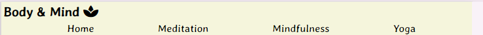

# Body & Mind
Body & Mind is a website designed to help people learn more about meditation, mindfulness and yoga. It is for people who are interested in learning techniques to help them relax. It is also for those who would like to start practising one of the three areas. This website is targeted to people of all ages.

Through Body & Mind people will  be able to decide whether they would like to find out more and by using the website they will be able to find some links to more information alongside an introductory video and a helpful guide on how to get started.

## Features

### Navigation bar

In the top left of every page is the website name which links back to the home page. Just below this and across the whole screen is the navigation bar which provides links to all four pages of the website. The name of each link in the navbar makes it clear to the user where they can navigate to next. The links become underlined when the mouse hovers over so users know it is clickable.

### Landing page image

This section includes an image of a beach with a header over the top. The image is there to be immediately calming and relaxing, to set the tone for the rest of the website. The header over the image is there to to explain the intention of the website and on the other pages it is there to let the user know which page they are on. There is a light background to the header so it is easier for the user to see the text.

### Home page content

In the main content of the home page there are three boxes, one for each of the areas covered by the website, which gives a brief description of what they are. In addition to the navbar, the headers in theses boxes have a link to the page they are referring to, giving the user the option, should they wish, to navigate to that page and find out more. Again these headers are underlined when the mouse hovers over them, to make it clear they are clickable. 

Below the first three boxes is another calming image of a beach during a sunset with an about us section. This section is to give the user a more indepth explanation of what we offer. The about us box is a different colour so it stands out from the rest of the website due to the fact that it provides information about us rather than the three areas.

### Signup section

Here the website gives the opportunity to sign up to the newsletter to find out more about what we offer. I inverted the colours of the sign up button so it would stand out more to encourage users to take action. I also included another calming image which the form section hovers over to carry on our theme. This section is on every page to give the user the opportunity to sign up whenever they would like. 

### Footer

In the footer section we have links to our social media accounts, allowing the user to connect with us and become more involved. This is also on every page allowing the user to easily find us on social media.

### Meditation page

In the main content section of this page we have a box which explains the benefits associated with meditating. This comes with an embedded video from YouTube of a 10 minute meditation walkthrough for beginners. After that is a box with a list of techniques people can do to help them get started with meditation. Then there is an image of someone meditating in a similar colour scheme as to the rest of the website. Finally there is a 'What next?' box which provides links to apps to help people continue with their meditation.

### Mindfulness page

The first box on this page explains what mindfulness is and how it can help. This is followed by an embedded video from YouTube to further explain mindfulness. The next box lists ways people can practice mindfulness with another calming image afterwards. Finally there is a 'What next?' box which has suggestions of podcasts people can listen to for more information and guidance.

### Yoga page

On our final page we have a box that talks about the benefits of doing yoga followed by an embedded video of a 10 minute yoga session for beginners giving the user the opportunity to try it out. This is followed by a box talking about the video and the benefits of practicing yoga in the morning. Then there is an image of someone doing yoga in colours that fit the colour theme of the overall website. Lastly there is a 'What next?' box recommending a couple of YouTube channels, that post videos of yoga workouts, with links to their channels.

### Font, colours and images

I researched fonts that are considered relaxing and calming and found that the best ones seemed to flow naturally with few straight lines which led me to find Averia Gruesa Libre on Google fonts and I'm very pleased with how it has turned out. 

The fonts in different sections have been purposefully sized so it is easy for the user to understand the flow of the content. 

I also researched what colours are considered to be calming and found that pastel colours and beige would acheive the desired effect. I decided to make the background colour beige to bring about the calming effect and make the text boxes a darker colour so they would stand out but also not detract from the overall effect. 

Once I had the colour scheme I then purposefully found images on Pexels which related to the content as well as fitted in with the colours I had chosen and again I'm pleased with the outcome.

## Testing

I have tested this page on Chrome and Safari with no issues. Also on my mobile, laptop and larger screens. The website is responsive and the layout changes depending on the screen size. I also tested the form which works as it should.

## Validator testing

### CSS

No errors were found.

### HTML

 - For the text over the landing page image I used a 'p' rather than a header which was picked up and has subsequently been fixed. 
 - In one of the text boxes I closed the 'p' after a 'ul' which was also highlighted but I've since corrected my mistake. 
 - Finally I used the same 'id' across multiple boxes so as to retain the colours and format but have since changed them to 'class'.

### Accessibility 

Running the website through the lighthouse proves there are no issues with the colours and fonts.

## Deployment

The site was deployed to GitHub pages. The steps to deploy are as follows:
 - In the GitHub repository, go to the Settings tab 
 - From code and automation, go to pages
 - Deploy from the main branch and refresh the page until the link to the website appears 

The live link is as follows - https://tomh131.github.io/meditation-mindfulness-yoga/ 

## Credits

 - The code for the social media links came from the Love Running project.
 - The images came from Pexels.
 - The font came from Google fonts.
 - The videos are from YouTube.
 - The title icon and social media icons are from Font Awesome.