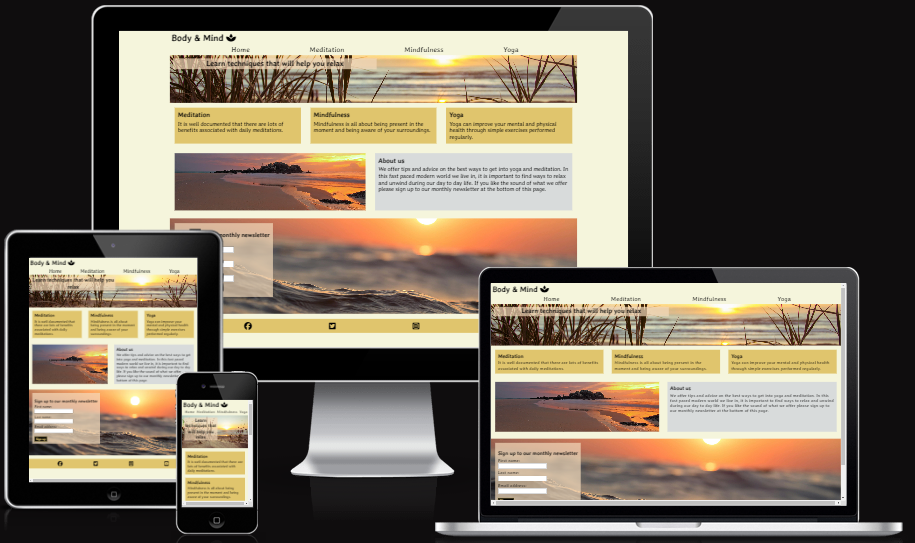
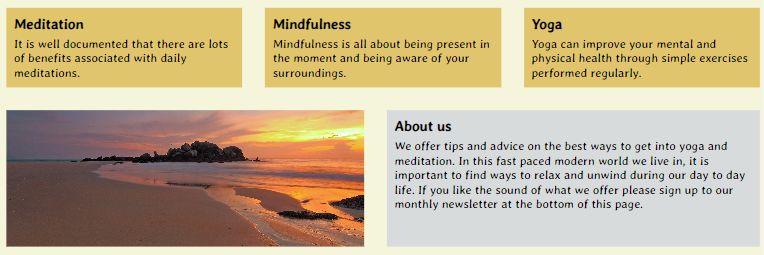
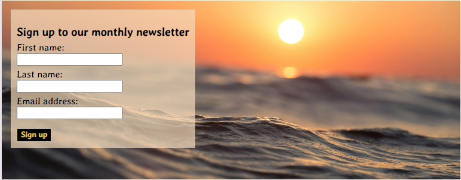

# Body & Mind
Body & Mind is a website designed to help people learn more about meditation, mindfulness and yoga. It is for people who are interested in discovering how it can help them both mentally and physically. It is also for those who would like to get into one of the three areas.

Through Body & Mind people will  be able to decide whether they would like to find out more and by using the website they will be able to find some links to more information alongside an introductory video and a helpful guide on how to get started.

## Features

### Navigation bar

In the top left of every page is the website name which links back to the homepage. Just below this and across the whole screen is the navigation bar which provides links to all four pages of the website. The name of each link in the navbar makes it clear to the user where they can navigate to next

### Landing page image

This section includes an image of a beach with some text over top. The image is there to be calming and relaxing which will be immediately apparent to the user and let them know what the website is all about. The text over the image on the homepage is there to explain the intention of the website and on the other pages it is there to let the user know which page they are on. 

### Homepage content

In the main content of the homepage we have three boxes, one for each of the areas we cover, where we give a brief description of what they are. In addition to the navbar, the headers in theses boxes have a link to the page they are referring to, giving the user the option, should they wish, to navigate to that page and find out more. Below the boxes is another calming image of a beach during a sunset with an about us section. This section is to give the user a more indepth explanation of what we offer. The about us box is a different colour so it stands out from the rest of the website due to the fact that it provides information about us rather than the three areas.

### Signup section

Here we give the option to the user to find out more about what we offer. I inverted the colours of the signup button so it would stand out more. I also included another calming image which the form section hovers over to carry on our theme. This section is also on every page to give the user to opportunity to signup whenever they would like. 

### Footer

In the footer section we have links to our social media accounts, allowing the user to connect with us and become more involved. This is also on every page allowing the user to easily find our us on social media.

### Meditation page

In the main content section of this page we have a box which explains the benefits associated with meditating. This comes with an embedded video from youtube of a 10 meditation for beginners. After that is a box with a list of techniques people can do to help the user get started with meditation. Then there is an image of someone meditating in a similar colour scheme as to the rest of the website. Finally there is a 'What next?' box which provides links to some companies which have apps to help people with meditation.

### Mindfulness page

On this page we have the first box which explains what mindfulness is and how it can help. Which is followed by an embedded video from youtube to further explain mindfulness. This is then followed by a list of ways people can practice mindfulness with another calming image afterwards. Finally there is a 'What next?' box which has suggestions for a couple of podcasts people can listen to for more information and guidance.

### Yoga page

On our final page we have a box that talks about the benefits of doing yoga followed by an embedded video of a 10 minute yoga session for beginners giving the user the opportunity to try it out. This is followed by a box talking about the video and the benefits of practicing yoga in the morning. Then there is an image of someone doing yoga in colours that fit the colour theme of the overall website. Lastly there is a 'What next?' box recommending a couple of youtube channels, that post videos of yoga workouts, with links to their channels.

### Font, colours and images

I researched fonts that are considered relaxing and calming and found that the best ones seemed to flow naturally with not too many straight lines which led me to find Averia Gruesa Libre on Google fonts and I'm very pleased with how it has turned out.

I also found out what colours are considered to be calming and found that, pastel colours and beige would acheive the desired effect. I decided to make the background colour beige to bring about the calming effect and make the text boxes a darker colour so they would stand out but also not detract from the overall effect. 

Once I had the colour scheme I then purposefully found images on Pexels which related to the content as well as fitted in with the colours I had chosen and again I'm pleased with the outcome.

## Testing

I have tested this page on Chrome and Safari with no issues. Also on my mobile, laptop and larger screens. The website is responsive and changes layout depending on the screen size. I also tested the form which works as it should.

## Validator testing

### CSS

No errors were found

### HTML

 - For the text over the landing page image I used a 'p' rather than a header which was picked up and has subsequently been fixed. 
 - In one of the text boxes I closed the 'p' after a 'ul' which was also highlighted but I've since corrected my mistake. 
 - Finally I had used the same id across the multiple boxes so as to retain colours and format but they have since been changed to 'class'.

### Accessibility 

Running the website through the lighthouse proves there are no issues with the colours and fonts.

## Deployment

The site was deployed to GitHub pages. The steps to deploy are as follows:
 - In the GitHub repository, go to the Settings tab 
 - From code and automation, go to pages
 - Deploy from the main branch and refresh the page until the link to the website appears 

The live link is as follows - https://tomh131.github.io/meditation-mindfulness-yoga/ 

## Credits

 - The code for the social media links came from the Love Running project.
 - The images came from Pexels.
 - The font came from Google fonts.
 - The videos are from YouTube.
 - The social media icons are from Font Awesome.